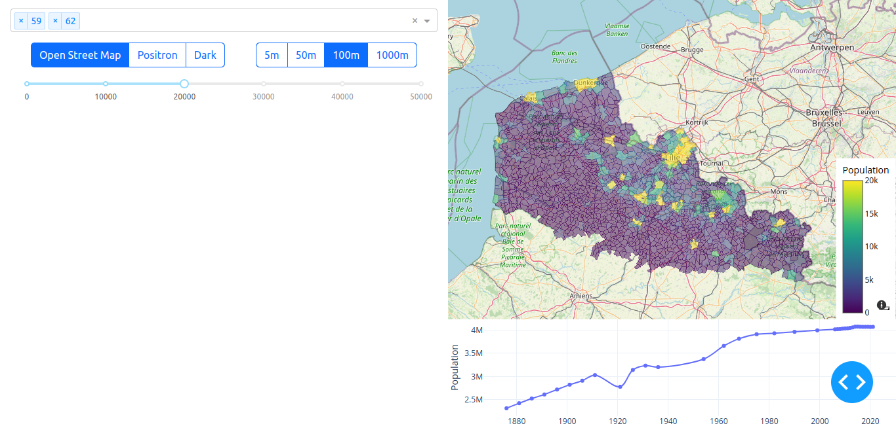

### [population-map-service-883336909258.europe-west9.run.app](population-map-service-883336909258.europe-west9.run.app)




Attributs
| Champ | Alias | Type |
| --- | --- | --- |
| objectid | | integer |
| reg | | char |
| dep | | char |
| cv | | char |
| codgeo | | char |
| libgeo | | char |
| p13_pop | | double |
| p14_pop | | double |
| p15_pop | | integer |
| p16_pop | Population municipale 2019 - Recensement 2016 | integer |
| p17_pop | Population municipale 2020 - Recensement 2017 | integer |
| p18_pop | Population municipale 2021 - Recensement 2018 | integer |
| p19_pop | Population municipale 2022 - Recensement 2019 | integer |
| p20_pop | Population municipale 2023 – recensement 2020 | integer |
| p21_pop | Population municipale 2024 - Recensement 2021 | integer |


https://etalab-datasets.geo.data.gouv.fr/contours-administratifs/latest/geojson/

https://www.insee.fr/fr/statistiques/3698339


base maps:
https://plotly.com/python/tile-map-layers/
```text
The accepted values for layout.mapbox.style are one of:

"white-bg" yields an empty white canvas which results in no external HTTP requests
"open-street-map", "carto-positron", and "carto-darkmatter" yield maps composed of raster tiles from various public tile servers which do not require signups or access tokens.
"basic", "streets", "outdoors", "light", "dark", "satellite", or "satellite-streets" yield maps composed of vector tiles from the Mapbox service, and do require a Mapbox Access Token or an on-premise Mapbox installation.
"stamen-terrain", "stamen-toner" or "stamen-watercolor" yield maps composed of raster tiles from the Stadia Maps service, and require a Stadia Maps account and token.
A Mapbox service style URL, which requires a Mapbox Access Token or an on-premise Mapbox installation.
A Mapbox Style object as defined at https://docs.mapbox.com/mapbox-gl-js/style-spec/
```